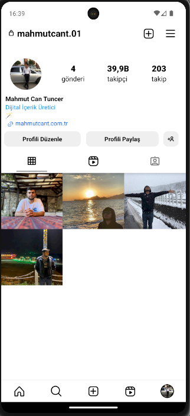

# Instagram Clone App

This is a React Native application that replicates key features of Instagram. The app includes functionalities such as a profile page with posts,explore, reels, and tagged sections, and formatted views for displaying reels.

## Features

- Profile Page with tabs for Posts, Videos, and Tagged items.
- Swipeable navigation between tabs.
- Customizable icons for active and inactive states.
- Number formatting utility for displaying follower counts and view counts in a compact format.

## Installation

1. Clone the repository:
   ```bash
   git clone https://github.com/mahmutcant/react-native-instagram-clone.git
   cd instagram-clone
   ```
2. Install Dependencies:
   ```bash
    # using npm
    npm start

    # OR using Yarn
    yarn start
    ```
3. Run the Application
   ```bash
   npm start
   # or 
   yarn start
   ```




